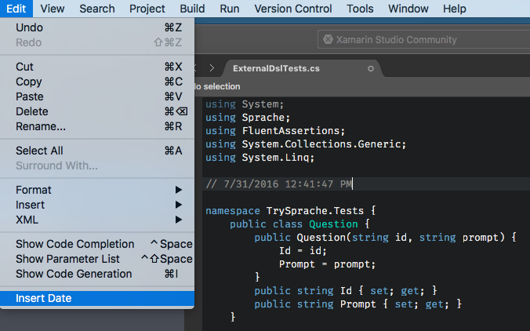

## XamarinStudio.InsertDate

Simple addin that insert current date into active editor.

## Create mpack file

> xbuild XamarinStudio.InsertDate/XamarinStudio.InsertDate.csproj /t:PackageAddin

## Links

- https://developer.xamarin.com/guides/cross-platform/xamarin-studio/customizing-ide/extending_xamarin_studio_with_addins
- https://github.com/mjh4/AddIns